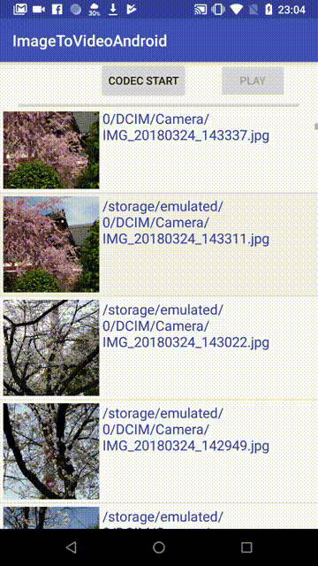

# ImageToVideoAndroid
[](http://developer.android.com/index.html)

[](https://android-arsenal.com/api?level=21)
<br>
Easy Image to Video Converter



## Gradle
Step 1. Add the JitPack repository to your build file
```groovy
allprojects {
	repositories {
		...
		maven { url 'https://jitpack.io' }
	}
}
```
Step 2. Add the dependency
```groovy
dependencies {
        implementation 'com.github.MasayukiSuda:ImageToVideoAndroid:v0.0.4'
}
```
## Usage
```Kotlin
  imageToVideo = ImageToVideoConverter(
      outputPath = outputVideoPath,
      inputImagePath = inputImagePath,
      size = Size(720, 720),
      duration = TimeUnit.SECONDS.toMicros(4),
      listener = object : EncodeListener {
        override fun onProgress(progress: Float) {
          Log.d("progress", "progress = $progress")
          runOnUiThread {
            progressBar.progress = (progress * 100).toInt()
          }
        }

        override fun onCompleted() {
          runOnUiThread {
            progressBar.progress = 100
          }
        }
	
        override fun onFailed(exception: Exception) {

        }
     }
    )
  imageToVideo?.start()
```


## Sample Dependencies
* [glide](https://github.com/bumptech/glide)

## License

[MIT License](https://github.com/MasayukiSuda/ImageToVideoAndroid/blob/master/LICENSE)
